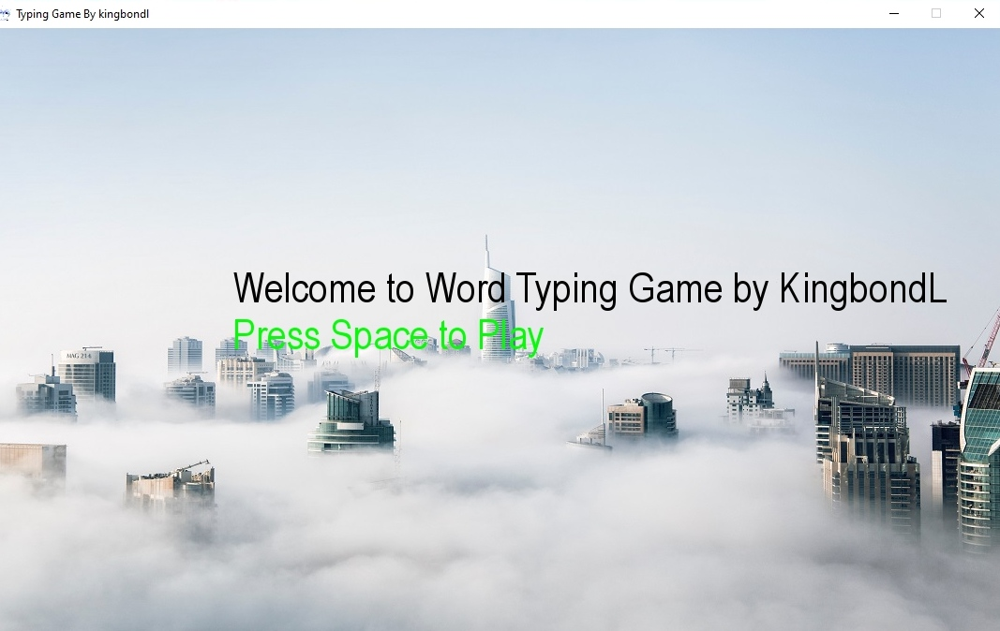

# Typing-Word-Game-Python
It's a typing game, where you type words falling from the top of the screen.

Python Project on Typing Word Game with the help of pygame library.Have you played a typing speed game? It’s a very useful game to track your typing speed and improve it with regular practice. Now, you will be able to build your own typing speed game in Python by just following a  code  and application.
When normal people want to learn typing, they use softwares like Typing master. But since we are programmers, we can use our knowledge to write our own typing tutor app. Python, as always will be best for this purpose as it is easy to understand and provides a lot of libraries for our specific purpose.
This Python project idea, we are going to build an exciting project through which you can check and even improve your typing speed. For a graphical user interface, we are going to use the pygame library which is used for working with graphics. We will draw the images and text to be displayed on the screen.
Prerequisites
The project in Python requires you to have basic knowledge of python programming and the pygame library.
To install the pygame library, type the following code in your terminal.
  pip install pygame
